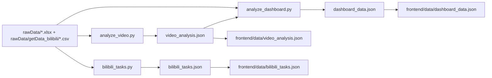

# 中国地方戏剧数字传播评价与决策平台

## 1. 项目说明

这是一个面向“地方戏曲数字传播分析”的数据与可视化项目。  
项目将 B 站视频元数据、评论采样、弹幕文本、剧种档案、受众画像整合为统一分析结果，用于回答以下问题：
- 哪些省份/剧种在当前样本中传播表现更强。
- 传播热度与互动质量是否匹配。
- 受众画像和 TGI 显示出怎样的人群偏好。
- 弹幕高频词、情感和高能片段如何支持内容优化。

## 2. 项目目标

- 建立可复现的数据分析链路（抓取 -> 清洗 -> 指标计算 -> JSON 输出）。
- 用统一指标体系衡量视频传播效果。
- 提供全国与省级两个分析层级，支持看板交互展示。
- 为内容运营给出数据支撑与 AI 辅助解读。

## 3. 核心能力

- 视频级传播指标计算：`spreadHeat`、`interactionQuality`、`score`、`spreadLevel`。
- 省级结构分析：强/中/弱分布、资源-传播类型判定、Top10 对比。
- 文本分析：词云、高频词情感标签、高能弹幕窗口提取。
- 人群分析：性别年龄画像、TGI 聚合与 AI 解释。
- 看板展示：地图下钻、雷达、词云、TGI弹窗、视频卡片、调度日志。

## 4. 技术栈

- Python：`pandas`、`openpyxl`、`jieba`、`requests`、`python-dotenv`
- 前端：`ECharts`、`echarts-wordcloud`、原生 HTML/CSS/JS
- AI：Qwen 接口（通过 `Qwen_Analysis.py` + `modules/qwen_utils.py`）

## 5. 快速开始

### 5.1 安装依赖

```bash
pip install -r requirements.txt
```

### 5.2 准备环境变量

在项目根目录创建 `.env`（仓库默认已忽略该文件）：

```env
BILIBILI_COOKIE=你的B站Cookie
DASHSCOPE_API_KEY=你的DashScope Key
```

### 5.3 一键构建分析数据

```bash
python dataProcess/dataProcess_Scripts/build_all_data.py
```

### 5.4 分步执行（可选）

```bash
python dataProcess/dataProcess_Scripts/analyze_video.py
python dataProcess/dataProcess_Scripts/analyze_dashboard.py
python dataProcess/dataProcess_Scripts/bilibili_tasks.py
```

### 5.5 打开前端

```text
frontend/index.html
```

## 6. 数据处理链路



## 7. 项目文件树（含文件说明）

> 说明：以下为业务相关文件。`.venv/`、`.git/` 等环境/版本控制目录不展开。

```text
4C_Province_Final/
├─ .env                                  # 环境变量（至少包含 BILIBILI_COOKIE / DASHSCOPE_API_KEY）
├─ .gitignore                            # Git 忽略规则（当前仅忽略 .env）
├─ requirements.txt                      # Python 依赖
├─ dataProcess/
│  ├─ rawData/
│  │  ├─ allOperas_Unprocessed.xlsx      # 全国/各省剧种基础表（含省份、剧种、非遗级别、起源时间等）
│  │  ├─ audiencePortrait.xlsx           # 各省受众画像与 TGI 原始表
│  │  ├─ bilibili_tasks.xlsx             # B站抓取任务表（bvid/opera/province/status）
│  │  └─ getData_bilibili/
│  │     ├─ video_info.csv               # 视频元数据（播放、点赞、投币、收藏、弹幕总数等）
│  │     ├─ comments_data.csv            # 评论明细（采样评论文本）
│  │     └─ danmaku_data.csv             # 弹幕明细（时间点 + 文本）
│  └─ dataProcess_Scripts/
│     ├─ build_all_data.py               # 一键总入口：串联视频分析 + 看板分析
│     ├─ analyze_video.py                # 生成视频级分析 JSON
│     ├─ analyze_dashboard.py            # 生成全国/省级看板 JSON
│     ├─ bilibili_tasks.py               # 将 bilibili_tasks.xlsx 转换为 bilibili_tasks.json
│     ├─ getData_bilibili.py             # B站抓取脚本（视频信息/评论/弹幕）
│     ├─ Qwen_Analysis.py                # Qwen API 调用封装（ask_qwen）
│     ├─ modules/
│     │  ├─ common_utils.py              # 通用读写、字段匹配、数值转换工具
│     │  ├─ video_utils.py               # 视频级指标计算、关键词/高能弹幕提取、视频级AI分析
│     │  ├─ dashboard_builder.py         # 看板总装配（地图、词云、雷达、TGI、结构分析）
│     │  ├─ dashboard_utils.py           # 兼容层（导出 build_dashboard_data）
│     │  ├─ opera_utils.py               # 剧种数量、非遗级别、起源朝代分桶
│     │  ├─ audience_utils.py            # 受众画像聚合与 TGI 分析
│     │  ├─ radar_utils.py               # 6维雷达词典与雷达得分计算
│     │  ├─ wordcloud_utils.py           # 词云构建与词云情感分析合并
│     │  ├─ score_utils.py               # 省级评分统计、传播结构分类、全国对比分析
│     │  └─ qwen_utils.py                # Qwen JSON 解析/容错/降级逻辑
│     └─ processedData/
│        ├─ video_analysis.json          # 已生成的视频级结果样例
│        ├─ dashboard_data.json          # 已生成的看板级结果样例
│        └─ bilibili_tasks.json          # 已生成的任务状态样例
└─ frontend/
   ├─ index.html                         # 页面骨架与各弹窗容器
   ├─ css/
   │  └─ style.css                       # 全局样式与可视化页面风格
   ├─ js/
   │  ├─ echarts.min.js                  # ECharts 库
   │  ├─ echarts-wordcloud.min.js        # ECharts 词云插件
   │  ├─ data.js                         # 全局状态、数据结构适配（新JSON -> 旧前端结构）
   │  ├─ charts.js                       # 各图表实例初始化与更新函数
   │  ├─ ui.js                           # 弹窗、交互、终端日志、视频卡片等UI逻辑
   │  └─ main.js                         # 页面主流程（加载数据、绑定交互、首屏渲染）
   ├─ data/
   │  ├─ China.geojson                   # 中国地图 GeoJSON
   │  ├─ video_analysis.json             # 前端直接读取的视频级结果
   │  ├─ dashboard_data.json             # 前端直接读取的看板级结果
   │  └─ bilibili_tasks.json             # 前端底部调度日志读取数据
   └─ images/
      └─ covers/
         ├─ BV1p44y1s7z1.webp            # 视频卡片封面
         ├─ BV1PR4y1u71z.webp            # 视频卡片封面
         └─ BV1RF411v7Hp.webp            # 视频卡片封面
```

## 8. 指标计算方法（严格按代码）

### 8.1 视频级核心指标（`modules/video_utils.py`）

#### 8.1.1 传播热度指数 `spreadHeat`

先对每个规模型指标做 `log1p` 后的 Min-Max 归一化（同批样本内）：

- `view_norm = minmax(log1p(view))`
- `like_norm = minmax(log1p(like))`
- `favorite_norm = minmax(log1p(favorite))`
- `coin_norm = minmax(log1p(coin))`
- `danmaku_norm = minmax(log1p(danmaku))`

再加权：

`spreadHeat = (0.35*view_norm + 0.25*like_norm + 0.15*favorite_norm + 0.15*coin_norm + 0.10*danmaku_norm) * 100`

最后保留 1 位小数。

#### 8.1.2 互动质量指数 `interactionQuality`

先计算率：
- `like_rate = like / view`
- `coin_rate = coin / view`
- `favorite_rate = favorite / view`
- `danmaku_rate = danmaku / view`

对四个率分别做 Min-Max 归一化后加权：

`interaction_quality_raw = 0.30*minmax(like_rate) + 0.25*minmax(coin_rate) + 0.25*minmax(favorite_rate) + 0.20*minmax(danmaku_rate)`

再乘播放量置信度：

`view_confidence = min(1, log1p(view) / log1p(10000))`

`interactionQuality = interaction_quality_raw * view_confidence * 100`

最后保留 1 位小数。

#### 8.1.3 综合评分 `score`

`score = 0.6 * spreadHeat + 0.4 * interactionQuality`

保留 1 位小数。

#### 8.1.4 传播分层 `spreadLevel`

对 `score` 做分位阈值：
- `low = 33%分位`
- `high = 66%分位`

若样本数 `< 5` 或 `low >= high`，回退为 `low=50, high=70`。

分类规则：
- `score >= high` -> `强传播`
- `low <= score < high` -> `中等传播`
- `< low` -> `弱传播`

#### 8.1.5 评论样本数口径

`commentSampleCount` 来自 `comments_data.csv` 明细按 `bvid` 计数回填。  
代码明确忽略 `video_info.csv` 中可能存在的“评论总数”列，避免口径混淆。

#### 8.1.6 弹幕高能时刻与关键词

- 时间窗：每 `10` 秒聚合一次弹幕数（`time_window = floor(progress_sec/10)*10`）
- 高能弹幕：取峰值时间窗中的弹幕文本（最多 50 条）
- 关键词：`jieba` 分词 + 停用词过滤 + 仅保留中文词 + 长度>1，取 TopN（默认20）

### 8.2 看板级指标（`modules/score_utils.py`、`radar_utils.py`、`audience_utils.py`）

#### 8.2.1 省份平均评分

从 `video_analysis.json` 提取每条视频 `score`，按省份聚合：

`avgScore = sum(scores) / videoCount`

#### 8.2.2 省级传播结构柱状分布（强/中/弱）

对省内每条视频 `score`，使用全样本阈值（33%/66%分位）分类后计数：
- `bars = [{强传播: n1}, {中等传播: n2}, {弱传播: n3}]`

#### 8.2.3 资源等级 / 传播等级 / 结构类型

1) 资源等级（按剧种数）：
- `operaCount >= 25` -> `多`
- `10 <= operaCount < 25` -> `中`
- `< 10` -> `少`

2) 传播等级（按 `avgScore` 与省均分阈值）：
- `avgScore >= avg_high` -> `高`
- `avg_low <= avgScore < avg_high` -> `中`
- `< avg_low` -> `低`

3) 结构类型（资源×传播）映射：
- `多-高: 均衡发展型`
- `多-中: 资源转化提升型`
- `多-低: 资源待激活型`
- `中-高: 潜力成长型`
- `中-中: 稳步发展型`
- `中-低: 传播提质型`
- `少-高: 特色突破型`
- `少-中: 基础培育型`
- `少-低: 起步孵化型`
- 样本为 0 -> `样本不足`

#### 8.2.4 雷达图 6 维得分

维度：`服化道审美 / 二创与整活 / 名场面打卡 / 传统文化底蕴 / 剧情与价值观 / 唱腔与身段`  
每维原始值 = 该维关键词在评论文本中的出现次数之和。

归一方式：
- 若总命中为 0：全部返回 `60`
- 否则：  
  `log_score_i = log(raw_i + 1)`  
  `score_i = round(55 + (log_score_i / max_log_score) * (98 - 55))`

即最终雷达值约在 `[55, 98]`（无命中回退为60）。

#### 8.2.5 词云与情感分值

- 词云频次：同样基于 `jieba` + 停用词过滤后的词频 TopN。
- 情感：对 Top15 高频词批量调用 Qwen，返回：
  - `sentiment`（如正向/中性/负面）
  - `analysis`
  - `score`（字符串，限制在 `[-1.00, +1.00]`）

#### 8.2.6 受众画像与 TGI

省级：按 `audiencePortrait.xlsx` 每省分组后取第一条记录（`groupby(...).first()`）。  
全国：对各省记录取均值。

`ageGender` 的男女分布不是额外统计，而是：
- `male_age_bucket = age_percent_bucket * (male_percent/100)`
- `female_age_bucket = age_percent_bucket * (female_percent/100)`

TGI 数据直接来自表中字段，代码只做聚合与 AI 解读，不重新计算 TGI。

#### 8.2.7 剧种数量、非遗级别、起源朝代

- 剧种数：`max(省份字段括号内提示数, 去重后剧种名个数)`
- 非遗级别：按文本关键词映射为 `世界级/国家级/省级/市级/未计入`
- 起源朝代：清洗后分桶到 `元代/明代/清代/近现代/其他/未知`

## 9. 输出数据结构（简表）

### 9.1 `video_analysis.json`

- 根字段：`videos`、`representativeVideos`
- `videos[*]` 关键字段：`province`、`opera`、`bvid`、`stats`、`indexes`、`keywords`、`danmakuTrend`、`aiAnalysis`
- `indexes` 关键字段：`spreadHeat`、`interactionQuality`、`score`、`spreadLevel`

### 9.2 `dashboard_data.json`

- 根字段：`national`、`provinces`
- `national` 关键字段：`mapData`、`provinceScoreTop10`、`provinceOperaCountScoreCompare`、`operaCountScoreAI`、`wordCloud`、`radarScores`、`audiencePortrait`、`tgi`、`tgiAnalysis`
- `provinces[省名]` 关键字段：`operaCount`、`operas`、`heritageLevel`、`originDynasty`、`radarScores`、`audiencePortrait`、`tgi`、`tgiAnalysis`、`wordCloud`、`spreadStructure`

### 9.3 `bilibili_tasks.json`

- 根字段：`summary`、`processed`、`unprocessed`
- `summary`：`total`、`processed`、`unprocessed`

## 10. Qwen 调用与降级机制

- 统一通过 `modules/qwen_utils.py` 调用。
- 连续失败达到 3 次后，当前流程内自动禁用 Qwen（使用 fallback 文本）。
- 所有 AI 输出均要求 JSON 解析；解析失败也会自动回退。

## 11. 结果文件与前端数据目录说明

- Python 脚本默认输出目录是 `dataProcess/output/`（运行时自动创建）。
- 当前仓库内展示数据位于：
  - `dataProcess/dataProcess_Scripts/processedData/*.json`
  - `frontend/data/*.json`

如需刷新前端展示，需确保 `frontend/data/` 下 JSON 与最新分析结果一致。

## 12. 口径与限制说明

- 所有评分/指数均为“同批样本内相对指标”，不能外推为行业绝对标准。
- 评论数据是采样文本，不能等同于真实评论总量。
- 省份视频数是当前样本覆盖量，不代表真实内容供给规模。
- 词云和情感分析受分词词典、停用词表、采样窗口影响。

## 13. 常见问题（FAQ）

### 13.1 为什么有时 AI 文案是 fallback？

通常是 API Key 缺失、接口失败或返回内容非 JSON。代码会自动降级，保证流程不中断。

### 13.2 为什么同一视频在不同批次分层可能变化？

分层阈值来自当前批次分位数（33%/66%），样本池变化会导致阈值变化。

### 13.3 前端打开后没有数据怎么办？

优先检查：
- `frontend/data/*.json` 是否存在且字段完整。
- 浏览器控制台是否报 JSON 路径错误。
- 是否将新输出同步到 `frontend/data/`。

## 14. 后续可扩展方向

- 增加时间序列分析（按抓取时间对比趋势）。
- 增加多平台数据源（不只 B 站）。
- 增加自动化调度与增量更新管道。
- 增加单元测试与数据校验规则（schema/质量门禁）。

